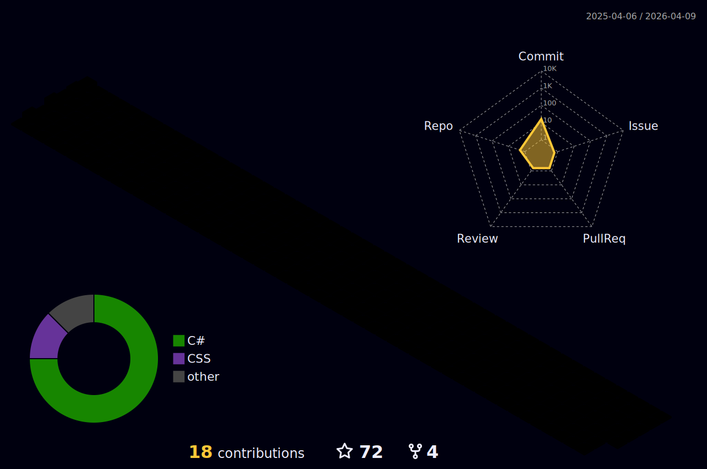

## Hellooo, I'm Caio :3  
I'm buzzing around, always looking to enhance my coding skills to create amazing and innovative projects. I believe programming is an art form, and I'm here to explore all its possibilities!

## Technologies I'm currently learning and pollinating with:

## Favorite hives (IDEs):
    

## Stats (Look at this buzz-y hive of activity!)

## Contributions

## Let’s Connect and Make Honey!  
Whether you’re into projects that need a touch of honey (or code), or just want to chat, feel free to reach out! 🐝  

