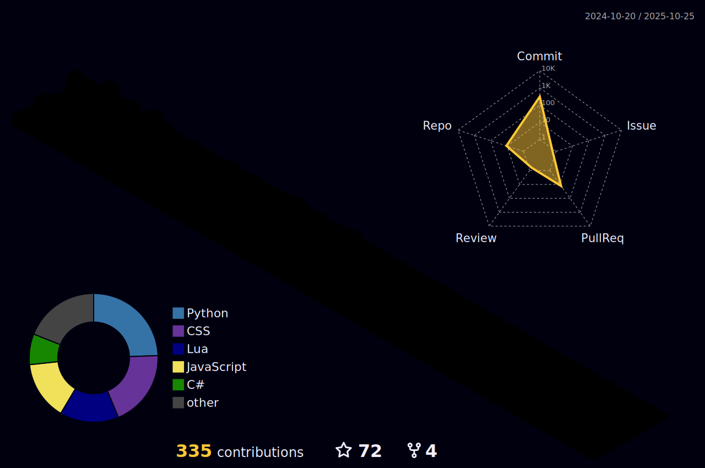

## Hellooo, I'm Caio :3  
I'm buzzing around, always looking to enhance my coding skills to create amazing and innovative projects. I believe programming is an art form, and I'm here to explore all its possibilities!  

### My **mission**?  
To blend creativity and logic into meaningful solutions that inspire and deliver value.

## Technologies I'm currently learning and pollinating with: 
### Programming Languages:
 

### Frameworks:
 

### Frontend Development:

### Backend Development:

### Database:

### Devops:

### Others:
 

## Favorite hives (IDEs):  
Here’s where the magic happens! My **favorite hives** for crafting code are:  

 
---

## Stats (Look at this buzz-y hive of activity!)  
  
  

## Contributions
  

## Let’s Connect and Make Honey! 🍯  
Whether you’re into projects that need a touch of honey (or code) or just want to chat, feel free to reach out:  

  
